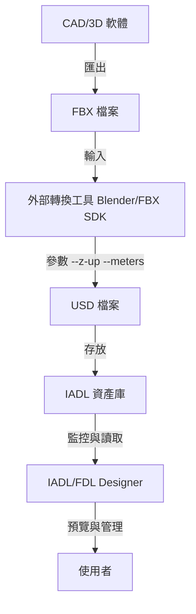

# FBX 到 USD 轉換策略更新 v1.2

**文件狀態**: 草案
**作者**: Michael Lin 林志錚
**日期**: 2025-10-22

---

## 1. 挑戰與動機

在先前的架構中，我們曾考慮使用 `pyassimp` 等函式庫在應用程式內部直接讀取 FBX 檔案，並手動將其幾何數據、材質、骨架等資訊轉換為 USD 格式。然而，這個方法帶來了幾個嚴峻的挑戰，構成了此次策略更新的核心動機。

- **轉換品質不可靠**: 手動處理難以保證所有細節的準確性。
  - **材質轉換不完整**: FBX 的 PBR 材質（如 `Stingray PBS`）或傳統材質（`Phong`, `Lambert`）與 USD 的 `UsdPreviewSurface` 材質模型之間存在複雜的對應關係。手動轉換經常導致貼圖（Albedo, Normal, Roughness, Metallic, AO）和參數對應不準，造成視覺效果失真。
  - **法線與 UV 錯亂**: 不正確的法線（Normal）和 UV 座標處理會導致渲染時出現接縫、光照錯誤或貼圖錯位。
  - **骨架與蒙皮（Skeleton & Skinning）丟失**: 骨架動畫的轉換極為複雜，涉及骨骼層次、權重綁定和動畫曲線。手動處理的失敗率很高，且難以除錯。

- **高昂的維護成本**: 
  - **FBX 版本相容性**: FBX 格式有眾多版本，`pyassimp` 等通用函式庫對新版本的支援往往滯後，導致解析失敗或數據丟失。
  - **程式碼複雜度**: 需要編寫大量程式碼來處理各種邊緣情況，當 FBX 格式更新時，這些程式碼也需要同步更新。

為了確保數據轉換的 **準確性**、**可靠性** 和 **可維護性**，我們決定更新轉換策略，將轉換的核心任務從應用程式內部轉移到外部的官方或專業工具鏈。

## 2. 新策略：外部化轉換流程

新策略的核心是將 FBX→USD 的轉換視為一個獨立的、預處理的步驟，而不是在 IADL/FDL Designer 應用程式中即時進行。應用程式本身將不再包含複雜的 FBX 解析與轉換邏輯，僅負責監控和匯入已生成的 USD 檔案。

### 2.1 架構圖



### 2.2 轉換策略對比

| 策略 | 優勢 | 劣勢 | 推薦度 |
| :--- | :--- | :--- | :--- |
| **pyassimp + 手寫** | - 純 Python<br>- 無外部依賴 | - 品質問題 (材質/法線/UV)<br>- 維護成本高<br>- FBX 版本相容性差 | ❌ 不推薦 |
| **Autodesk FBX SDK** | - **官方黃金標準**<br>- 功能最完整<br>- 版本相容性最好 | - 需 C++ 開發與綁定<br>- 授權問題<br>- 部署與整合複雜 | ✅ **長期目標** |
| **Blender Python API** | - **一步到位**<br>- 開源免費<br>- 功能完整<br>- 可編寫腳本自動化 | - 需安裝 Blender<br>- 啟動時間較長 (~2-3s) | ✅✅ **原型首選** |
| **USD 官方工具** | - 官方支援<br>- 穩定可靠 | - 需兩步轉換 (FBX→glTF→USD)<br>- 需安裝多個工具 | ✅ 可行備選 |
| **外部轉檔服務** | - 零維護<br>- 雲端處理 | - 需網路連線<br>- 數據隱私風險<br>- 成本考量 | ⚠️ 特定場景 |

### 2.3 推薦方案：Blender 自動化腳本

綜合考量開發效率、轉換品質與部署難度，我們在**快速原型階段推薦使用 Blender Python API** 作為主要轉換方案。

- **理由**: 它在功能完整性、成本和自動化潛力之間取得了最佳平衡。雖然 Autodesk FBX SDK 是最高標準，但其開發複雜度較高，更適合在專案成熟後作為長期優化的方向。

## 3. 實作設計

本節提供基於 Blender 的 `FBXToUSDService` 服務的 Python 實作細節，包括轉換服務本身、用於驗證的 `USDValidator`，以及與 PyQt6 GUI 整合的進度對話框範例。

### 3.1 Blender 轉換腳本 (`blender_fbx_to_usd.py`)

此腳本由 Blender 在背景模式下執行，負責單一檔案的轉換。

```python
# blender_fbx_to_usd.py
import bpy
import sys
import os

def fbx_to_usd(fbx_path: str, usd_path: str, up_axis: str = 'Z', length_unit: str = 'm'):
    bpy.ops.wm.read_factory_settings(use_empty=True)
    
    print(f"[Blender] Importing FBX: {fbx_path}")
    bpy.ops.import_scene.fbx(
        filepath=fbx_path,
        use_custom_normals=True,
        use_image_search=True,
        use_anim=True
    )
    
    bpy.context.scene.unit_settings.system = 'METRIC'
    if length_unit == 'mm':
        bpy.context.scene.unit_settings.scale_length = 0.001
    elif length_unit == 'cm':
        bpy.context.scene.unit_settings.scale_length = 0.01
    elif length_unit == 'm':
        bpy.context.scene.unit_settings.scale_length = 1.0
    
    # Blender 預設 Z-up，若需 Y-up 則需旋轉
    if up_axis == 'Y':
        for obj in bpy.context.scene.objects:
            if obj.type == 'MESH':
                obj.rotation_euler[0] += 1.5708  # 90 度 (π/2)

    print(f"[Blender] Exporting USD: {usd_path}")
    bpy.ops.wm.usd_export(
        filepath=usd_path,
        export_materials=True,
        export_normals=True,
        export_uvmaps=True,
        export_armatures=True,
        export_animation=True,
        use_instancing=False # Instancing 由 FDL 控制
    )
    
    print(f"[Blender] Conversion complete: {fbx_path} → {usd_path}")

if __name__ == '__main__':
    argv = sys.argv
    argv = argv[argv.index("--") + 1:]
    
    if len(argv) < 2:
        print("Usage: blender --background --python blender_fbx_to_usd.py -- <in.fbx> <out.usd> [up_axis] [unit]")
        sys.exit(1)
    
    fbx_to_usd(*argv)
```

### 3.2 FBX 轉換服務 (`fbx_to_usd_service.py`)

這個服務類別封裝了呼叫 Blender 腳本的邏輯，提供了更簡潔的 API 和進度回報機制。

```python
# fbx_to_usd_service.py
import subprocess
import os
from typing import Optional, Callable
from pathlib import Path

class FBXToUSDService:
    def __init__(self, blender_path: str = 'blender', script_path: str = 'blender_fbx_to_usd.py'):
        self.blender_path = blender_path
        self.script_path = script_path
        self._check_blender()

    def _check_blender(self):
        try:
            result = subprocess.run([self.blender_path, '--version'], capture_output=True, text=True, timeout=10)
            if result.returncode != 0:
                raise RuntimeError("Blender not found or not working")
            print(f"[FBXToUSDService] Blender found: {result.stdout.strip()}")
        except (FileNotFoundError, subprocess.TimeoutExpired) as e:
            raise RuntimeError(f"Blender check failed: {e}")

    def convert(self, fbx_path: str, usd_path: str, up_axis: str = 'Z', unit: str = 'm', callback: Optional[Callable] = None) -> bool:
        if not os.path.exists(fbx_path):
            print(f"[Service] Error: FBX file not found: {fbx_path}")
            return False
        
        os.makedirs(os.path.dirname(usd_path), exist_ok=True)
        
        cmd = [self.blender_path, '--background', '--python', self.script_path, '--', fbx_path, usd_path, up_axis, unit]
        print(f"[Service] Converting: {' '.join(cmd)}")
        
        if callback: callback(0.0, "Starting conversion...")

        try:
            process = subprocess.Popen(cmd, stdout=subprocess.PIPE, stderr=subprocess.PIPE, text=True)
            
            for line in process.stdout:
                print(line.strip())
                if callback and '[Blender]' in line:
                    if 'Importing' in line: callback(0.3, "Importing FBX...")
                    elif 'Exporting' in line: callback(0.7, "Exporting USD...")
            
            process.wait()
            
            if process.returncode == 0 and os.path.exists(usd_path):
                if callback: callback(1.0, "Conversion complete")
                print(f"[Service] Success: {usd_path}")
                return True
            else:
                stderr = process.stderr.read()
                print(f"[Service] Error: {stderr}")
                return False
        except Exception as e:
            print(f"[Service] Exception: {e}")
            return False
```

### 3.3 USD 驗證器 (`usd_validator.py`)

轉換完成後，使用此驗證器確保產生的 USD 檔案符合基本品質標準。

```python
# usd_validator.py
from pxr import Usd, UsdGeom
from typing import List, Tuple

class USDValidator:
    def validate(self, usd_path: str) -> Tuple[bool, List[str]]:
        errors = []
        try:
            stage = Usd.Stage.Open(usd_path)
            if not stage:
                errors.append("Failed to open USD stage")
                return False, errors

            if not UsdGeom.GetStageUpAxis(stage): errors.append("Missing Up Axis metadata")
            if not UsdGeom.GetStageMetersPerUnit(stage): errors.append("Missing Meters Per Unit metadata")
            if not stage.GetDefaultPrim(): errors.append("No default prim set")

            mesh_count = sum(1 for p in stage.Traverse() if p.IsA(UsdGeom.Mesh))
            if mesh_count == 0: errors.append("No meshes found in USD file")

            print(f"[USDValidator] Validation complete. Found {mesh_count} meshes. Errors: {len(errors)}")
            return len(errors) == 0, errors
        except Exception as e:
            errors.append(f"Exception: {e}")
            return False, errors
```

### 3.4 GUI 整合範例 (`PyQt6`)

提供一個進度對話框，以非同步方式執行轉換並向使用者回報進度。

```python
# conversion_progress_dialog.py
from PyQt6.QtWidgets import QDialog, QVBoxLayout, QLabel, QProgressBar, QPushButton
from PyQt6.QtCore import QThread, pyqtSignal

class ConversionThread(QThread):
    progress_updated = pyqtSignal(float, str)
    conversion_finished = pyqtSignal(bool, str)
    
    def __init__(self, service: FBXToUSDService, fbx_path: str, usd_path: str, up_axis: str, unit: str):
        super().__init__()
        # ... (store parameters)

    def run(self):
        success = self.service.convert(self.fbx_path, self.usd_path, self.up_axis, self.unit, self.progress_updated.emit)
        self.conversion_finished.emit(success, "Conversion complete" if success else "Conversion failed")

class ConversionProgressDialog(QDialog):
    def __init__(self, parent=None):
        super().__init__(parent)
        # ... (setup UI: QLabel, QProgressBar, QPushButton)
    
    def start_conversion(self, service: FBXToUSDService, fbx_path: str, usd_path: str, up_axis: str = 'Z', unit: str = 'm'):
        self.thread = ConversionThread(service, fbx_path, usd_path, up_axis, unit)
        self.thread.progress_updated.connect(self.on_progress_updated)
        self.thread.conversion_finished.connect(self.on_finished)
        self.thread.start()
        self.exec()

    def on_progress_updated(self, progress: float, message: str):
        self.progress_bar.setValue(int(progress * 100))
        self.status_label.setText(message)

    def on_finished(self, success: bool, message: str):
        self.status_label.setText(message)
        self.accept() if success else self.reject()
```

## 4. 結論與優勢

採用外部化的 FBX→USD 轉換策略，是 IDTF V3.5 在架構上的一項重要改進。它帶來了顯著的優勢：

- **降低應用程式複雜度**: IADL/FDL Designer 的核心邏輯保持輕量，專注於資產定義和工廠佈局，而非處理複雜的檔案格式轉換。
- **提高轉換品質**: 依賴 Blender 等專業工具，確保了材質、骨架等複雜數據轉換的最高保真度。
- **風險隔離**: 將潛在的轉換失敗風險隔離在一個獨立的外部工具中，不會影響主應用程式的穩定性。
- **標準化與一致性**: 透過統一的轉換腳本和參數，確保所有進入資產庫的 USD 檔案都遵循相同的座標系統、單位和結構標準。
- **易於擴展與維護**: 未來若需支援其他格式（如 glTF, STEP），只需開發新的外部轉換器，而無需修改主應用程式的核心程式碼。

此策略不僅解決了先前方案中存在的技術難題，還使得整個資產管理流程更加 **穩健**、**標準化** 和 **可擴展**，為使用者提供更穩定、更高效的數位孿生設計體驗。
