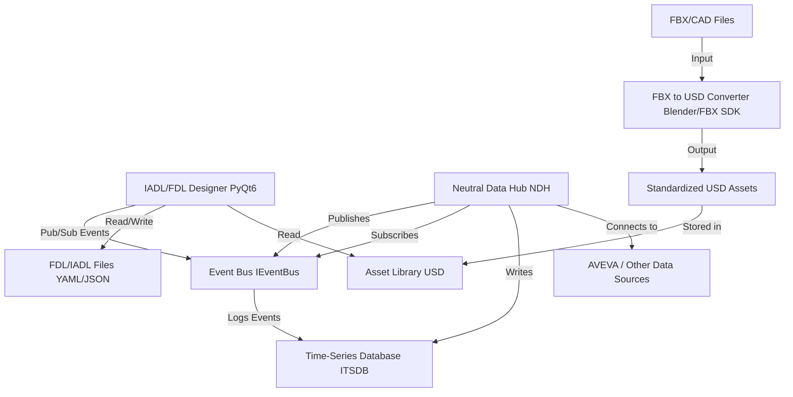

# IDTF Fast Prototype 軟體設計文件

**版本**: 2.1  
**日期**: 2025-10-22  
**作者**: Michael Lin 林志錚  
**組織**: HTFA/Digital Twins Alliance

---

## 1. 專案概述與目標

### 1.1 專案背景

IDTF (Industrial Digital Twin Framework) Fast Prototype 專案旨在開發一個快速原型設計工具，用於創建、編輯和模擬工業數位孿生場景。此工具將支援 IADL (Industrial Asset Definition Language) 和 FDL (Factory Definition Language)，實現從資產定義到工廠佈局的完整工作流程。

### 1.2 設計目標

本設計文件 v2.0 整合了 FDL v0.1 規格、NDH 事件模型、幾何座標系統對齊和 FBX 到 USD 轉換策略等多項關鍵設計更新，旨在提供一個更穩健、可擴展和高效的系統架構。

**核心目標**：

- **標準化數據模型**: 採用 FDL v0.1 作為工廠佈局的標準，並統一 IADL 中的座標系統規範。
- **事件驅動架構**: 引入 NDH（Neutral Data Hub）作為事件中心，實現模組之間的解耦和異步通信。
- **高保真資產管道**: 建立一個外部化的、標準化的 FBX 到 USD 轉換管道，確保幾何、材質和座標系統的一致性。
- **可演進的技術棧**: 設計抽象的 Event Bus 和 TSDB 介面，支援從輕量級（MVP）到生產級（Production）的平滑過渡。

---

## 2. 系統架構設計

### 2.1 整體架構圖



### 2.2 核心組件職責

| 組件 | 主要職責 |
|---|---|
| **IADL/FDL Designer** | - 提供圖形化介面，用於創建和編輯 IADL 和 FDL 檔案。<br>- 3D 視窗，用於可視化 USD 資產和工廠佈局。<br>- 透過 Event Bus 與 NDH 交互，接收實時數據更新，發布用戶操作事件。 |
| **Neutral Data Hub (NDH)** | - 作為系統的數據中樞，連接外部數據源（如 AVEVA）。<br>- 監聽數據變化，將其轉換為標準化的 `TagValueChanged` 事件並發布到 Event Bus。<br>- 處理來自 Designer 的控制命令事件。 |
| **Event Bus** | - 實現事件的發布/訂閱機制，解耦 Designer 和 NDH。<br>- 提供事件持久化和重放功能。<br>- 支援多種傳遞保證級別。 |
| **Time-Series Database (TSDB)** | - 存儲所有 `TagValueChanged` 事件的歷史數據。<br>- 提供高效的時序數據查詢和聚合功能。 |
| **Asset Pipeline** | - **外部化流程**，負責將原始 3D 模型（FBX, CAD）轉換為標準化的 USD 資產。<br>- **座標系統統一**：確保所有 USD 資產都遵循 Z-up、米制、右手座標系統。<br>- **幾何標準化**：處理三角化、法向量計算、UV 校正等。 |
| **Asset Library** | - 存儲由 Asset Pipeline 生成的標準化 USD 資產。 |
| **FDL/IADL Files** | - 以 YAML/JSON 格式存儲工廠佈局和資產定義。 |

---

## 3. 核心組件詳細設計

### 3.1 IADL/FDL Designer

- **UI 層**: 使用 **PySide6 (LGPL)** 框架作為預設 GUI 綁定，降低商業授權風險。設計抽象的 GUI 介面層，允許在需要時切換到 PyQt6。
- **3D 視圖**: 整合 **OpenUSD Python API**，實現 USD Stage 的加載、渲染和交互。
- **Transform 處理**: 必須使用 `Geometry_Coordinate_Tag_Alignment_Design.md` 中定義的 **`TransformUtils`** 來計算完整的矩陣鏈，確保 Tag 位置在複雜層級和變換下的準確性。
- **事件交互**: 透過 `IEventBus` 介面訂閱 `TagValueChanged` 事件以更新 3D 視圖，並發布 `InstanceCreated`、`InstanceUpdated` 等用戶操作事件。

### 3.2 Neutral Data Hub (NDH)

NDH 的設計完全遵循 `NDH_Event_Model_and_TSDB_Design_Update.md` 文件。

- **事件契約 (IDL)**: 所有事件必須遵循使用 **JSON Schema** 定義的標準結構，以 `BaseEvent` 為基礎。
- **Event Bus 抽象**: 核心邏輯僅與 `IEventBus` 介面交互，不依賴具體實現。演進路徑：**In-Memory (MVP) → ZMQ/MQTT (Production)**。
- **TSDB 抽象**: 核心邏輯僅與 `ITSDB` 介面交互。演進路徑：**SQLite (MVP) → DuckDB/Parquet (Mid-term) → TDEngine/InfluxDB (Production)**。

### 3.3 Asset Pipeline

資產管道的設計整合了 `FBX_to_USD_Conversion_Strategy_Update.md` 和 `Geometry_Coordinate_Tag_Alignment_Design.md` 的核心思想。

- **外部化轉換**: 轉換過程獨立於主應用程序。推薦使用 **Blender Python API** 作為快速原型階段的轉換工具，因其對 FBX 和 USD 的支持較好，且易於自動化。
- **標準化輸出**: 
  - **座標系統**: 輸出必須為 **Z-up, 米制, 右手座標系**。
  - **幾何**: 網格必須**三角化**，法向量和 UV 必須正確生成。
- **驗證**: 轉換後的 USD 文件應包含座標系統元數據（`upAxis`, `metersPerUnit`），並通過 `FBXToUSDConverter` 中的驗證步驟。

---

## 4. 數據模型與介面規範

### 4.1 FDL (Factory Definition Language) v0.1

FDL 用於描述完整的工廠佈局，其詳細規格見 `FDL_v0.1_Specification.md`。

- **頂層結構**: `version`, `coordinate_system`, `site`, `assets`, `connections`。
- **`coordinate_system`**: 強制規定 `length_unit`, `up_axis`, `handedness`。
- **`AssetInstance`**: 包含 `asset_id`, `instance_id`, `transform`, `tag_overrides`。
- **USD 組合策略**: 採用 **Reference + Variant** 策略，高效重用資產。

### 4.2 IADL (Industrial Asset Definition Language)

IADL 用於定義單個資產。

- **核心欄位**: `asset_id`, `name`, `model` (指向 USD 文件), `tags`, `coordinate_system`。
- **`local_transform`**: Tag 的位置使用相對於資產原點的局部變換矩陣定義。

### 4.3 事件模型 (Event IDL)

所有事件均繼承自 `BaseEvent`。

**BaseEvent Schema**:
```json
{
  "type": "object",
  "required": ["event_id", "event_type", "timestamp", "source", "version"],
  "properties": {
    "event_id": { "type": "string", "format": "uuid" },
    "event_type": { "type": "string" },
    "timestamp": { "type": "string", "format": "date-time" },
    "source": { "type": "string" },
    "version": { "type": "string", "pattern": "^\\d+\\.\\d+\\.\\d+$" },
    "correlation_id": { "type": "string", "format": "uuid" },
    "seq": { "type": "integer" }
  }
}
```

**TagValueChanged 事件範例**:
```json
{
  "event_type": "TagValueChanged",
  "asset_id": "pump_001",
  "tag_id": "tag_flow_001",
  "value": 125.5,
  "quality": "Good",
  "unit": "m³/h"
}
```

---

## 5. 技術棧

| 類別 | 技術 | 理由 |
|---|---|---|
| **程式語言** | Python 3.9+ | 生態豐富，與 OpenUSD、PyQt6 兼容性好。 |
| **GUI 框架** | **PySide6 (LGPL)** | 官方 Qt for Python 綁定，LGPL 授權降低商業法務風險，功能與 PyQt6 相當。保留介面抽象以支援 PyQt6 替換。 |
| **3D 圖形** | OpenUSD (Python API) | 數位孿生領域的事實標準，具備強大的場景描述和組合能力。 |
| **數據格式** | YAML, JSON | 人類可讀，易於編輯和解析。 |
| **事件總線 (MVP)** | In-Memory (同步) | 實現簡單，零依賴，適用於單體應用原型。 |
| **時序數據庫 (MVP)** | SQLite | 輕量級，零配置，適合本地開發和原型驗證。 |
| **3D 模型轉換** | Blender (Python API) | 開源，跨平台，提供強大的 FBX 導入和 USD 導出功能。 |
| **開發工具** | VS Code, Git | 主流開發工具，社區支持廣泛。 |
| **環境管理** | **uv** 或 **conda** | 鎖定依賴版本，確保跨平台可重建性。 |
| **打包工具 (MVP)** | PyInstaller | 快速原型階段使用，需注意 Qt plugin 路徑問題。 |
| **打包工具 (備選)** | **Nuitka** 或 **Briefcase** | Nuitka 提供更穩定的 Qt 支援；Briefcase 生成原生包，減少 DLL/.dylib 問題。 |

---

## 6. 部署與打包策略

### 6.1 跨平台挑戰與解決方案

**識別的問題**：

- **PyInstaller + Qt + USD 綁定**：在 Windows 和 macOS 上容易遇到 DLL/.dylib/插件路徑問題，導致應用程式無法啟動或功能異常。
- **PyQt6 商業授權風險**：PyQt6 使用 GPL 授權，商業應用需購買商業授權，否則必須開源整個應用程式。

**解決方案**：

#### 6.1.1 GUI 框架選擇

- **預設使用 PySide6 (LGPL)**：PySide6 是 Qt 官方的 Python 綁定，使用 LGPL 授權，允許商業應用使用而無需開源整個應用程式（僅需動態連結）。
- **保留抽象介面**：設計一個薄的 GUI 抽象層（例如 `gui_adapter.py`），封裝 Qt 的核心功能，使得在需要時可以切換到 PyQt6。

```python
# gui_adapter.py - 抽象層範例
from typing import Protocol

class QtAdapter(Protocol):
    """Qt 框架的抽象介面"""
    def create_main_window(self) -> object:
        ...
    def create_3d_widget(self) -> object:
        ...

# 實際使用時，根據配置選擇
if USE_PYSIDE6:
    from PySide6 import QtWidgets, QtCore
else:
    from PyQt6 import QtWidgets, QtCore
```

#### 6.1.2 環境管理

- **使用 uv 或 conda**：
  - **uv**：新一代 Python 包管理器，速度快，支援鎖檔（`uv.lock`），確保跨平台依賴一致性。
  - **conda**：成熟的跨平台包管理器，特別適合處理 OpenUSD 等複雜依賴。

```bash
# 使用 uv 鎖定依賴
uv pip compile requirements.in -o requirements.txt
uv pip sync requirements.txt

# 或使用 conda
conda env create -f environment.yml
conda env export > environment.lock.yml
```

#### 6.1.3 CI/CD 跨平台測試

- **雙平台可重建測試**：在 CI 中建立 Windows 11 和 macOS 14 的測試環境，確保每次提交都能在兩個平台上成功建置和執行。

```yaml
# .github/workflows/ci.yml 範例
name: Cross-Platform Build Test

on: [push, pull_request]

jobs:
  build:
    strategy:
      matrix:
        os: [windows-2022, macos-14]
        python-version: ['3.9', '3.10', '3.11']
    runs-on: ${{ matrix.os }}
    steps:
      - uses: actions/checkout@v3
      - name: Set up Python
        uses: actions/setup-python@v4
        with:
          python-version: ${{ matrix.python-version }}
      - name: Install dependencies
        run: |
          pip install uv
          uv pip sync requirements.txt
      - name: Run tests
        run: pytest tests/
      - name: Build package
        run: pyinstaller app.spec
```

#### 6.1.4 打包工具選擇

| 工具 | 優點 | 缺點 | 適用階段 |
|------|------|------|----------|
| **PyInstaller** | 成熟穩定，社區支持廣泛 | Qt plugin 路徑問題需手動調整 | MVP 階段 |
| **Nuitka** | 對 Qt 支援較好，生成 C 編譯的執行檔 | 編譯時間較長 | 生產階段 |
| **Briefcase** | 生成原生包（.app, .exe），減少 DLL 問題 | 配置較複雜 | 生產階段 |

**推薦策略**：

- **MVP 階段**：使用 **PyInstaller**，快速驗證，但需在 `.spec` 檔中明確指定 Qt plugin 路徑。

```python
# app.spec 範例
a = Analysis(
    ['main.py'],
    pathex=[],
    binaries=[],
    datas=[
        ('assets', 'assets'),
        # 明確指定 Qt plugins
        (os.path.join(PYSIDE6_PATH, 'plugins'), 'PySide6/plugins'),
    ],
    hiddenimports=['PySide6.QtCore', 'PySide6.QtWidgets'],
    hookspath=[],
    hooksconfig={},
    runtime_hooks=[],
)
```

- **生產階段**：評估使用 **Nuitka** 或 **Briefcase**，減少部署問題。

```bash
# Nuitka 範例
python -m nuitka --standalone --enable-plugin=pyside6 \
  --include-data-dir=assets=assets \
  --output-dir=dist \
  main.py

# Briefcase 範例
briefcase create
briefcase build
briefcase package
```

### 6.2 部署檢查清單

- ☑️ 使用 PySide6 (LGPL) 作為預設 GUI 框架
- ☑️ 設計 GUI 抽象層，支援 PyQt6 替換
- ☑️ 使用 uv 或 conda 鎖定依賴版本
- ☑️ 在 CI 中建立 Windows 11 和 macOS 14 測試環境
- ☑️ MVP 階段使用 PyInstaller，明確指定 Qt plugin 路徑
- ☑️ 生產階段評估 Nuitka 或 Briefcase

---

## 7. 開發路線圖

### Phase 1: MVP (Minimum Viable Product)

- **目標**: 實現核心的 IADL/FDL 編輯和 3D 可視化功能。
- **功能**: 
  - 加載和顯示標準化的 USD 資產。
  - 手動編輯 IADL/FDL 文件並在視圖中刷新。
  - 使用 **In-Memory Event Bus** 和 **SQLite TSDB** 實現模擬數據的單向流動和顯示。
  - 提供手動執行的 **Blender 轉換腳本**。

### Phase 2: v1.1 - 自動化與整合

- **目標**: 提升開發效率和數據處理能力。
- **功能**:
  - 實作 **FBX 轉換服務**，監控文件夾並自動執行轉換。
  - 將 TSDB 升級到 **DuckDB + Parquet**，提升查詢性能和存儲效率。
  - 實現 `InstanceCreated`、`InstanceUpdated` 等事件，支持 GUI 操作的雙向同步。

### Phase 3: v1.2 - 邁向生產

- **目標**: 增強系統的可靠性和擴展性。
- **功能**:
  - 將 Event Bus 升級到 **ZMQ 或 MQTT**，支持跨進程/跨網絡通信。
  - 將 TSDB 升級到 **TDEngine 或 InfluxDB**，滿足生產環境的高性能讀寫需求。
  - 實現完整的事件重放和重送機制。
  - 整合對 **AVEVA** 等真實工業數據源的支持。

---

## 8. 參考文件

- `FDL_v0.1_Specification.md`
- `FBX_to_USD_Conversion_Strategy_Update.md`
- `NDH_Event_Model_and_TSDB_Design_Update.md`
- `Geometry_Coordinate_Tag_Alignment_Design.md`
- `Fast_Prototype_Technical_Development_Document_v1.1.md` (舊版參考)

